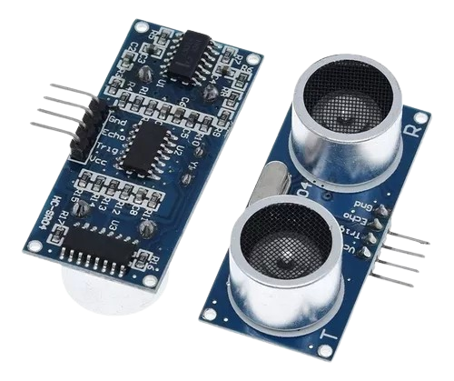
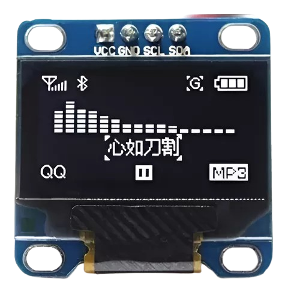
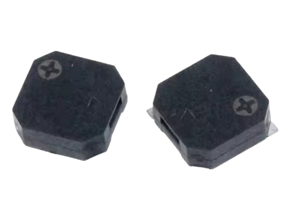

# Apresentação

**Nome:** Gabriel Martins Ribeiro

Olá, sou Gabriel Martins Ribeiro, engenheiro eletrônico formado pela FCTE - UnB, com experiência em biomédica e sistemas embarcados.

## Sobre o Projeto

Este projeto consiste em um sistema de tecnologia assistiva: uma bengala digital inteligente que orienta pessoas com deficiência visual por meio de estímulos auditivos. Utiliza uma placa Raspberry Pi e sensores periféricos, sendo desenvolvido em linguagem C.

## Módulos:

| Módulo                             | Descrição                                                                 | Figura                                                                 |
|------------------------------------|---------------------------------------------------------------------------|------------------------------------------------------------------------|
| **Sensor Ultrassônico (HCSR04)**  | Responsável pela detecção de obstáculos à frente do usuário.              |  |
| **Display OLED (SD1306)**         | Exibe informações relevantes, como distância até o obstáculo.             |               |
| **Buzzer (MLT8530)**              | Emite sinais sonoros para alertar o usuário sobre obstáculos detectados.   |                  |

## Apresentação do Sistema Completo

O sistema completo integra os módulos mencionados, proporcionando uma solução eficaz para a orientação de pessoas com deficiência visual. Abaixo, apresentamos uma visão geral do sistema:

(em breve)

Este vídeo ilustra a integração dos componentes e o fluxo de funcionamento do sistema, destacando a interação entre o sensor ultrassônico, o display OLED e o buzzer para fornecer feedback ao usuário.

(em breve)
