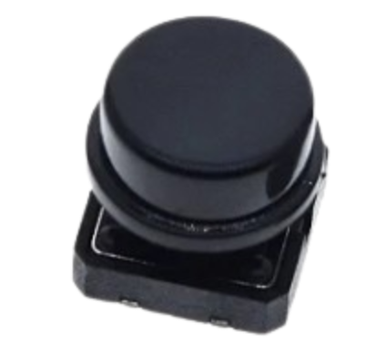

# 🔘 **Botão**  

  

  

O **botão físico** no **BR SmartGuia** permite ao usuário **interagir diretamente com o sistema**, ativando ou desativando funções importantes. Ele desempenha um papel essencial na navegação do carrinho, garantindo maior controle e personalização da experiência.  

---

## 📌 **1. O que é esse módulo?**  

O **botão** é um **interruptor momentâneo** que, ao ser pressionado, envia um sinal ao **Raspberry Pi Pico W**, acionando ou desativando funcionalidades do sistema.  

✅ **Fácil de usar** 🖲  
✅ **Baixo consumo de energia** 🔋  
✅ **Rápida resposta ao toque** ⚡  

Esse botão **aumenta a interatividade e acessibilidade**, permitindo que o usuário **tenha controle direto sobre alertas visuais e sonoros** do BR SmartGuia.  

---

## ⚙️ **2. Como ele funciona?**  

O **botão físico** opera como um **interruptor eletrônico**, funcionando com um sistema de **pulso elétrico**:  

🖱 **Fluxo de funcionamento do botão:**  
1️⃣ O usuário **pressiona o botão**, fechando o circuito.  
2️⃣ O **Raspberry Pi Pico W** detecta o sinal de ativação.  
3️⃣ O sistema **aciona ou desativa uma funcionalidade**.  
4️⃣ O **display OLED** pode exibir um feedback visual.  

💡 **Modo de funcionamento:**  
✔ Quando pressionado, **o circuito fecha e envia um sinal HIGH**.  
✔ Quando solto, **o circuito abre e o sinal retorna a LOW**.  
✔ O código do BR SmartGuia pode detectar **longos ou curtos pressionamentos** para diferentes funções.  

---

## 🎯 **3. Qual o papel dele no BR SmartGuia?**  

No **BR SmartGuia**, os botões permitem **controle manual** de algumas funções essenciais.  

🔘 **Funções do botão no sistema:**  
✅ Ativar/desativar os **LEDs de sinalização** 💡  
✅ Ligar ou silenciar o **buzzer de alerta** 🔊  
✅ Resetar ou pausar funções temporariamente 🔄  

📌 **Exemplo de uso:**  
🔹 O usuário pode **desligar os LEDs** caso não precise de sinalização extra.  
🔹 Se estiver em um ambiente silencioso, pode **desativar os alertas sonoros**.  
🔹 Permite reconfigurar o carrinho sem precisar reiniciá-lo completamente.  

---

## 🔄 **4. Como ele interage com os outros módulos?**  

O **botão** funciona em conjunto com os outros módulos do BR SmartGuia para permitir controle manual das funções.  

| 🔗 **Módulo** | 🛠 **Interação com o botão** |
|--------------|-------------------------------|
| **Matriz de LEDs RGB 5x5** | Ativa/desativa os **LEDs de sinalização**. 💡 |
| **Buzzer (MLT8530)** | Liga/desliga **alertas sonoros**. 🔊 |
| **Display OLED (SSD1306)** | Pode exibir um **feedback visual** quando pressionado. 📟 |
| **Raspberry Pi Pico W** | Processa os sinais do botão e executa ações. 🖥 |

📌 **Fluxo de funcionamento do botão:**  
1️⃣ O usuário **pressiona o botão** para ativar/desativar uma função.  
2️⃣ O **Raspberry Pi Pico W** interpreta o sinal e executa a ação.  
3️⃣ O sistema **atualiza os LEDs, buzzer ou exibição no display**.  
4️⃣ Se necessário, o **botão pode redefinir uma configuração temporária**.  

---

### 🚀 **Resumo do Botão no BR SmartGuia**  
✅ **Oferece controle manual das funcionalidades** 🖲  
✅ **Ativa/desativa LEDs e alertas sonoros** 💡🔊  
✅ **Simples, eficiente e de fácil integração** ⚡  
✅ **Melhora a experiência do usuário, permitindo personalização** 🎛 

Com esse botão, o **BR SmartGuia se torna mais interativo**, permitindo que o usuário **tenha controle sobre os alertas visuais e sonoros**, tornando a navegação mais confortável e adaptável! 🚀🔘 