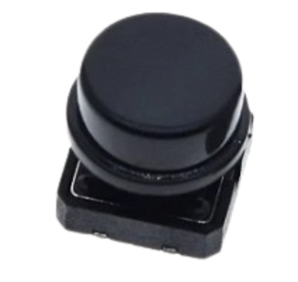
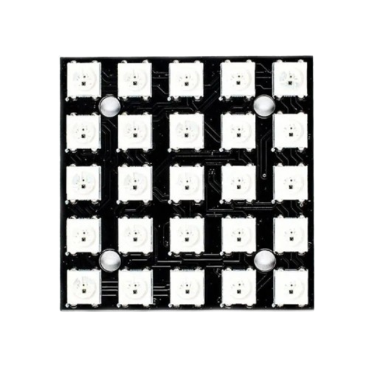
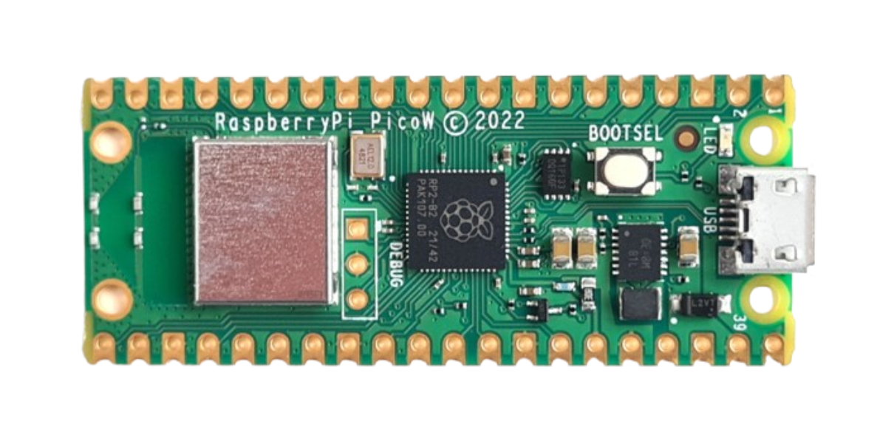
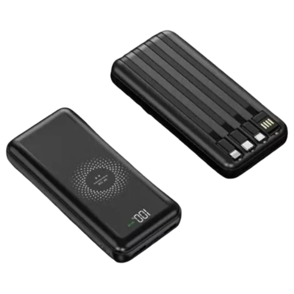
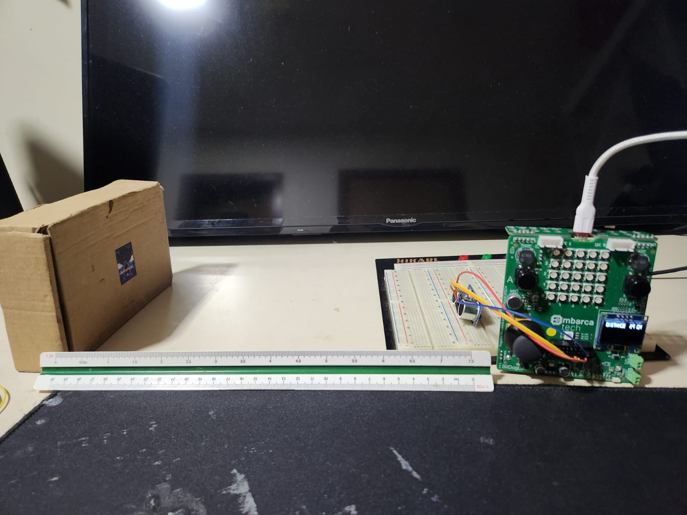

# 🚀 Apresentação

### Nome: Gabriel Martins Ribeiro  

  

  

Olá! Sou **Gabriel Martins Ribeiro**, engenheiro eletrônico formado pela **FCTE - UnB**, com experiência em **biomédica** e **sistemas embarcados**.  

---

## 🎯 Sobre o Projeto  

Este projeto é um **sistema de tecnologia assistiva**, desenvolvido para auxiliar **pessoas com deficiência visual** na navegação no ambiente através de **estímulos auditivos**.  

🔹 **Tecnologia:** Placa **Raspberry Pi** e sensores periféricos  
🔹 **Linguagem:** **C**  
🔹 **Funcionalidade:** Detecção de obstáculos e feedback sonoro  

---

## 🔧 Módulos Utilizados  

  <table>
    <tr>
      <th>🛠️ <b>Módulo</b></th>
      <th>📌 <b>Descrição</b></th>
      <th>🔍 <b>Figura</b></th>
    </tr>
    <tr>
      <td><b>Sensor Ultrassônico (HCSR04)</b></td>
      <td>Responsável pela detecção de obstáculos à frente do usuário.</td>
      <td></td>
    </tr>
    <tr>
      <td><b>Display OLED (SSD1306)</b></td>
      <td>Exibe informações relevantes, como distância até o obstáculo.</td>
      <td></td>
    </tr>
    <tr>
      <td><b>Buzzer (MLT8530)</b></td>
      <td>Emite sinais sonoros para alertar o usuário sobre obstáculos detectados.</td>
      <td></td>
    </tr>
    <tr>
      <td><b>Botão</b></td>
      <td>Permite ativar e desativar funcionalidades, como os LEDs de sinalização.</td>
      <td></td>
    </tr>
    <tr>
      <td><b>Matriz de LEDs RGB 5x5</b></td>
      <td>Exibe padrões visuais (bandeira do Brasil) para facilitar a identificação do usuário cego por terceiros.</td>
      <td></td>
    </tr>
    <tr>
      <td><b>Raspberry Pi Pico W</b></td>
      <td>Microcontrolador responsável pelo processamento e controle dos periféricos.</td>
      <td></td>
    </tr>
    <tr>
      <td><b>Fonte de Alimentação (Power Bank)</b></td>
      <td>Fornece energia ao sistema, garantindo mobilidade e autonomia.</td>
      <td></td>
    </tr>
  </table>

---

## 🔍 Apresentação do Sistema Completo  

O sistema integra os módulos mencionados para fornecer uma solução eficiente de **navegação assistida** para pessoas com deficiência visual.  

  

🎥 **Demonstração:** Veja como o sistema funciona na prática!  

  <video controls poster="assets/video/Thumb_BRSmartGuia.png" style="height: 500px;">
    <source src="assets/video/v_final.mp4" type="video/mp4">
    Seu navegador não suporta a reprodução de vídeos.
  </video>

